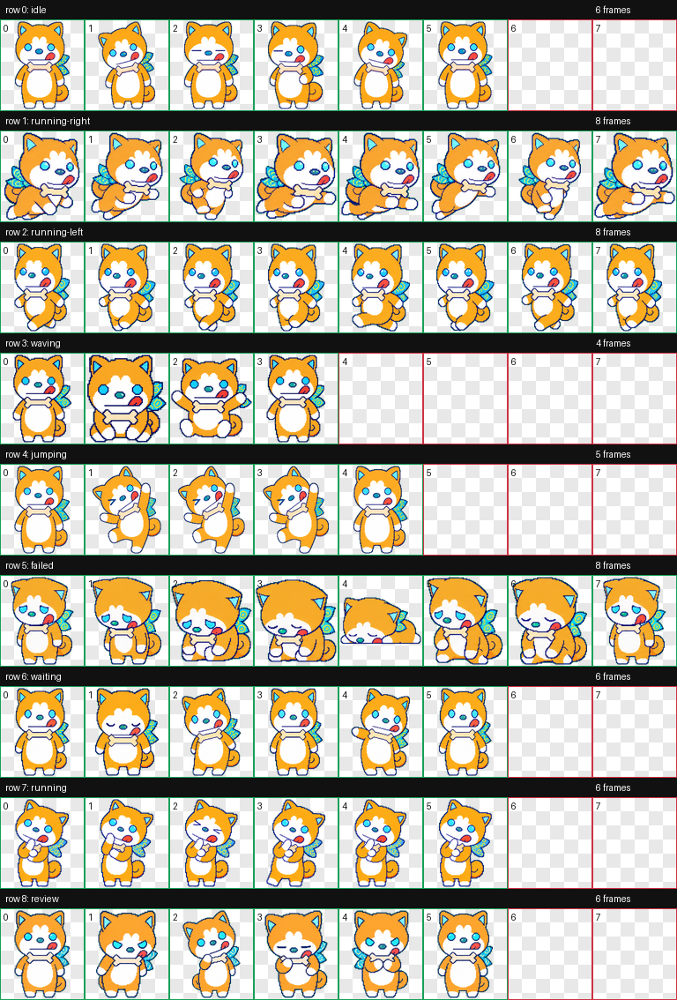

# ペロ２ / Pelops II Codex Pet

中文 | 这是一个 Codex Pet 自定义动画宠物包。角色来自《ゴジラ S.P ＜シンギュラポイント＞ / Godzilla Singular Point》里的ペロ２（ペロツー）/ Pelops II。官方角色介绍中，佩罗2是从沟通支援 AI “ナラタケ”诞生、住在神野铭电脑里的可爱犬型人工智能，并作为铭的伙伴协助她行动。官方设定还说明，佩罗2会一边支持铭，一边和她共同挑战“哥斯拉”的谜题。它不是普通宠物，而是能陪伴、交流并辅助行动的 AI 伙伴。这个自定义版本把佩罗2做成橙色 Q 版柴犬风格，包含蓝色眼睛、骨头项圈、蓝色花纹布、眨眼待机、悬浮动作、跑动和思考动作。

English | This is a Codex Pet custom animated pet package based on ペロ２ / Pelops II from *Godzilla Singular Point*. In the official character description, Pelops II is a cute dog-shaped artificial intelligence born from the communication-support AI “Naratake,” living in Mei Kamino's PC and supporting her as a companion. The official setting also describes Pelops II as helping Mei while they take on the mystery of Godzilla together. Rather than an ordinary pet, Pelops II is an AI partner who can accompany, communicate with, and support Mei's actions. This custom version reimagines Pelops II as an orange chibi shiba-style Codex-compatible animated pet with cyan eyes, a bone collar, a blue patterned cloth, blinking idle frames, hover motion, running, and thinking animations.

This is an unofficial fan-made Codex custom pet package. It is not affiliated with TOHO, Bones, Orange, Netflix, or the official *Godzilla Singular Point* production.

## Install

1. Download or clone this repository.
2. Copy the `pelo2--Twiliminal` folder into your Codex pets folder:

```bash
mkdir -p ~/.codex/pets
cp -R pelo2--Twiliminal ~/.codex/pets/
```

3. Restart Codex, or refresh the custom pets list in Codex settings.
4. Select `Pelops II` from custom pets.

## 安装

1. 下载或克隆这个仓库。
2. 把 `pelo2--Twiliminal` 文件夹复制到 Codex 的 pets 文件夹：

```bash
mkdir -p ~/.codex/pets
cp -R pelo2--Twiliminal ~/.codex/pets/
```

3. 重启 Codex，或者在 Codex 设置里刷新自定义宠物列表。
4. 在自定义宠物里选择 `Pelops II`。

## Files / 文件

- `pelo2--Twiliminal/pet.json` - Codex custom pet manifest.
- `pelo2--Twiliminal/spritesheet.webp` - Codex-compatible 8x9 pet spritesheet.
- `previews/` - contact sheet and row previews.
- `source/decoded/` - generated row strips used to build the final spritesheet.
- `source/prompts/rows/` - row prompts used during generation.
- `source/validation.json` and `source/review.json` - validation outputs.

## Preview / 预览



## Character Reference / 角色资料

- Official character page: [ゴジラ S.P ＜シンギュラポイント＞ Character](https://godzilla-sp.jp/character/)

## License / 许可

Released for public use as a Codex custom pet. See `LICENSE`.
